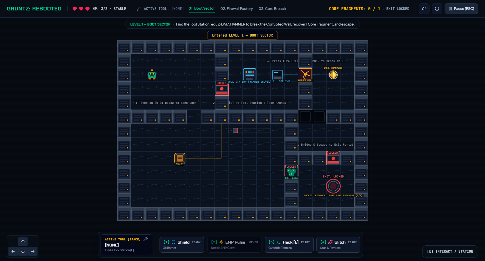

# GRUNTZ: REBOOTED

**Explore a corrupted mainframe. Choose the right tool. Restore the core.**

GRUNTZ: REBOOTED is a playable browser-based, top-down puzzle-strategy adventure. Guide a small Digital Grunt through three damaged sectors, manipulate system infrastructure, recover Core Fragments, and confront the Corrupted Core Guardian.

## Inspiration and reimagining

The project takes inspiration from *Gruntz* (1999): a small character, grid-like spaces, environmental puzzles, tools, hazards, and objective-led progression. It is not a remake. The familiar puzzle-strategy foundation is reinterpreted as a damaged computer mainframe, where doors become security gates, tools become system utilities, and collected fragments trigger security countermeasures.

## Gameplay

Explore each sector, read its layout, choose a tool or ability, and use switches, terminals, routes, and obstacles to reach the required Core Fragments and exit. Fragment recovery escalates security in later sectors. The game has three handcrafted sectors, a three-phase final guardian, health and retry handling, a pause menu, and a victory sequence.

### Tools and abilities

- **Shield [1]** — temporary protection from hazards and enemies.
- **EMP [2]** — requires the EMP Glove; disables nearby electronic threats and can damage the guardian when vulnerable.
- **Hack [3] / Interact [E]** — hack nearby terminals and perform contextual interactions.
- **Glitch [4]** — disrupt nearby threats and damage the guardian when vulnerable.
- **Physical tools** — carry one at a time. The Data Hammer breaks corrupted walls, Void Shovel clears soft-data obstacles, EMP Glove powers EMP, and Glitch Decoy distracts nearby enemies.

### Sectors

1. **Boot Sector** — introduces switches, tool stations, obstacles, a terminal, and fragment recovery.
2. **Firewall Factory** — adds lasers, security enemies, alternate routes, tool selection, and escalating security.
3. **Core Breach** — combines environmental puzzles and hazards with Surge Nodes and the Corrupted Core Guardian.

### Controls

| Input | Action |
| --- | --- |
| WASD / Arrow Keys | Move |
| E | Interact, use a nearby station, or hack a terminal |
| Space | Use the equipped physical tool |
| 1 | Shield |
| 2 | EMP (requires EMP Glove) |
| 3 | Hack |
| 4 | Glitch |
| Esc | Pause / resume; close the tool modal |

On-screen movement and interaction controls are also available on supported viewport sizes.

## How to play

1. Start the game and choose **Play Game** or select a sector.
2. Review the sector briefing and initialize it.
3. Explore, interact with the environment, and recover the required fragments.
4. Reach the unlocked exit. Complete the three sectors and purge the guardian to restore the system.

## Run locally

Requirements: Node.js and npm.

```bash
npm install --legacy-peer-deps
npm run dev
```

Open the local URL printed by Vite (by default, <http://localhost:3000>). The legacy peer-dependency option is currently needed because the declared Vite and esbuild versions have a peer dependency conflict.

Production checks:

```bash
npm run lint
npm run build
npm run preview
```

## Technology

TypeScript, React, Phaser, Vite, and Tailwind CSS. The game draws its Phaser textures at runtime and synthesizes its sound effects and music with the Web Audio API.

## Play and screenshots

- **Playable build:** [Play GRUNTZ: REBOOTED](https://gruntz-rebooted.ai.studio/)

### Boot Sector gameplay



## Credits and asset information

Game code, level layouts, and runtime-generated game graphics/audio are part of this project; individual contributors are not identified in the repository. The interface uses Lucide icons, and the page requests Chakra Petch, JetBrains Mono, and Plus Jakarta Sans from Google Fonts. Their attribution and license details need verification before release; see [ASSETS_CREDITS.md](./ASSETS_CREDITS.md).

This is a fan-inspired hackathon reinterpretation of *Gruntz* (1999), not a remake or an official product. It is not affiliated with, endorsed by, or sponsored by the original game's rights holders. The original title and related marks remain the property of their respective owners.
